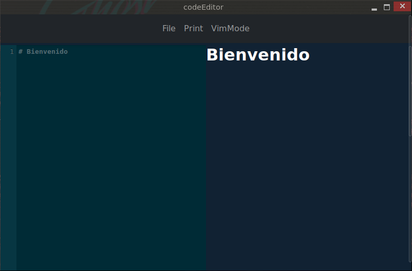

# CodeEditor



## Introducción

Esta aplicación te permite tener una vista previa de un documento escrito en **Markdown** y guardarlo como pdf o incluso imprimirlo. Puede ejecutarse desde un navegador ya que es una _SPA_, o también puede compilarse para funcionar como una aplicación de escritorio.

### Captura


### <u>IMPORTANTE</u>

La aplicación no guarda los cambios en ningún momento. Te recomiendo trabajar el documento sobre otro editor y utilizar la aplicación para tener una vista previa del documento antes de su impresión. Tienes opción de realizar algunos cambios en el documento con el editor incorporado y si todo es correcto, realizar la impresión o guardar como pdf.

La aplicación hace un salto de página por cada `## ` que transpila en `<h2 class="break-before"></h2>`. Esto es así ya que es como yo estructuro el documento, esta etiqueta en cabeza un nuevo capítulo y lo inicia en una página nueva.

También acepta cualquier código _html_ que quieras usar para personalizar el documento. Por ejemplo para añadir un salto de página puedes poner `<div class="break-before"></div>` esto generará un salto antes de este código, siempre y cuando exista algún elemento anterior.

### Motivación

Durante el primer curso de DAW me gustó mucho la sencillez de **Markdown** para la redacción de documentos que despúes pasaba a **pdf** ayudandome de la herramienta _pandoc_. Pero encuentré que la presonalización de las plantillas me obligaba ha aprender _LATEX_, que encuentro extremadamente complejo de aprender para tareas sencillas como las que me ocupaban.

También existe la posibilidad de usar _html_ para la trasformación en _pandoc_ sin embargo me seguia resultando complejo de entender y me decidí a realizar una aplicación que me permitiera transformar mis documentes escritos en **Markdown** a **pdf** usando tecnologías que conocía, como son las descritas más abajo.

### Tecnologías

Es una aplicación `angular` sobre un proyecto mínimo de `neutralinojs` el cual sirve para ejecutar aplicaciones web en una ventana del escritorio, para ello utiliza _webview_. Esta es una alternativa a _electron_ que no incorpora un navegador en el ejecutable, solo depende de alguna librería del SO. Por ejemplo en linux tienes que tener instalada la librería `libwebkit2gtk-4.0-37`. En Windows necesitas tener junto al ejecutable compilado una librearía que se adjunto tras la compilación `WebView2Loader.dll`. Para mac sinceramente no lo he probado ya que no tengo ningún equipo.

Para el apartado gráfico he incorporado `bootstrap 5` que facilita mucho aplicar estilos.

Otras librerías de las que depende la aplicación son `codemirror` es el editor que incorpora, y también `markdown-it` para transpilar **Markdown** a html.

## Plataformas

### Navegador

Como he comentado la aplicación puede ejecutarse desde cualquier navegador siempre y cuando el código compilado por angular sea subido a un servidor y accedido desde el navegador. También se puede ejecutar un servidor desde el ordenador local y acceder.

### Desktop

Una de las principales ideas del proyecto era que fuese una aplicación ejecutable desde el escritorio ya que es como deseaba ejecutarla. Personalmente encuentro que para proyectos sencillos como este usar _electron_ no lo más apropiado.  Tras varias pruebas de _webview_ en diferentes lenguajes coo _go_ y _rust_, decidí que lo más sencillo sería mantener el lenguaje (javascript) usando la herramienta `neutralinojs`. La encuentro muy apropiada para proyectos sencillos sin mucha carga de backend.

## Instalación

A continuación voy a intentar enumerar los pasos necesiarios para la descarga del repositorio y compilación del código para ser ejecutado.

### Dependencias

Entiendo que las dependencias son las siguientes:

- Angular cli
- `npm i -g @angular/cli`

**Aplicación de escritorio**
- Linux - libwebkit2gtk-4.0-37
- Windows - Microsoft Edge ?
- MacOs - Safari ?
- Neutralinojs
- `npm i -g @neutralinojs/neu`

### Pasos

- `git clone https://github.com/kennycallado/codeEditor`
- `cd codeEditor`
- `npm install`

En este punto si quires ejecutar la aplicación ten encuenta que la ruta de acceso sería
_http://localhost:3333/resources_.
- `ng serve`

Para compilar.
- `ng build`
- `neu build -r`

Y por último puedes ejecutar el siguiente comando desde el directorio.
- `./dist/codeEditor/codeEditor-linux_x64` -> por ejemplo para linux
- Para windows puedes acceder a este directorio y ejecutar el único fichero _.exe_.


### Nota

Ten encuenta que el proyecto tiene algunas características como el puerto `3333` para desarrollo y el punto de entrada en _resources_. Esto se puede configurar en el fichero _angular.json_. Para cambiar el punto de entrada debes encotrar la línea de `"baseHref": "/resources/",`.

## Todo

Hay una serie de mejoras que quiero implantar en algún momento, también depende de la motiviación que tenga.

- [x] Image support
- [ ] Cover
- [ ] Toc
- [ ] Footer
- [ ] Toggle VimMode
- [ ] Manage sessions
- [ ] Save document
- [ ] Different templates
- [ ] Html-Pdf without print

## Otras notas:

### Image support

Para añadir imágenes en el documento primero debes cargarlas en el navegador. Para ello en la barra de navegación click en `AddImage`, puedes seleccionar una o varias imágenes. Para agregarlas al documento solo tienes que poner el nombre de la imágen en lugar del src. Por ejemplo:

``` markdown
# Bienvenida


```

No es necesario poner el path del fichero ya que solo se guarda el nombre, por lo que es **IMPORTANTE** tener en cuenta que lo nombres de las imágenes deben ser únicos.

---


